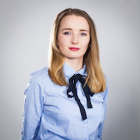
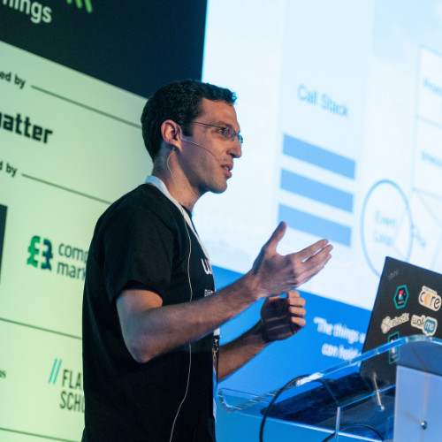
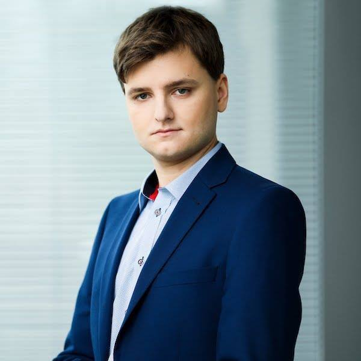
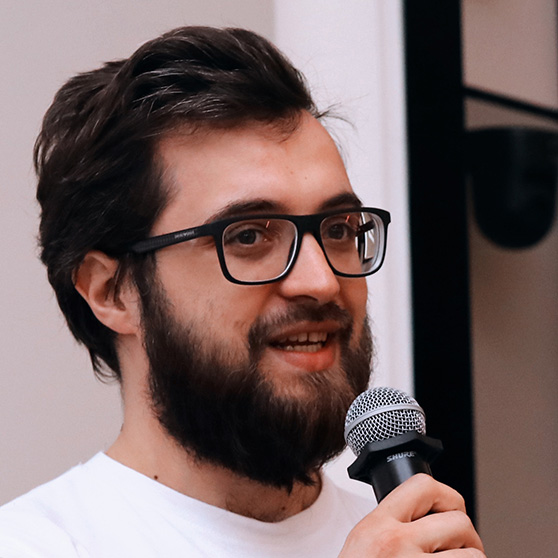
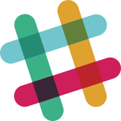
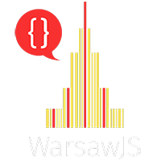
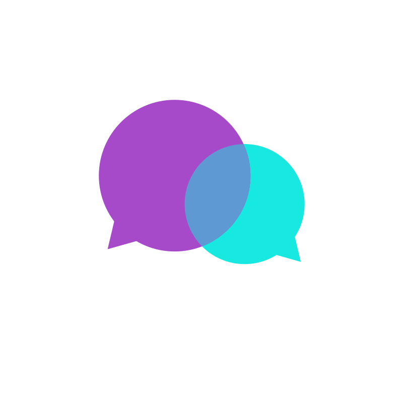

class: middle, slide-front-page

.size130[

# WarsawJS MasterClass #??

]

---

class: middle, center, slide-invert-colors, slide-card-list

# Organizatorzy

.card[ Piotr Kowalski]
.card[ Katarzyna Grabowska]
.card[ Piotr Zientara]

---

class: middle, center, slide-invert-colors, slide-card-list, slide-card-list-rounded

# Trener

.card[ Michał Bury]

<!-- .card[ Yonatan Kra] -->
<!-- .card[ Michał Szklarski] -->
<!-- .card[ Piotr Kowalski] -->
<!-- .card[ Kamil Grabek] -->

---

class: middle, center, slide-invert-colors, slide-middle-images, no-logo

# Sponsor

<!--  -->
<!--  -->

---

exclude: true
class: slide-invert-colors

# Zasady współpracy 📋

.size30[

* Trener decyduje o prędkości realizacji projektu, ALE kiedy skończyłeś
    wcześniej — daj znać — trener posiada dodatkowe zadania
* Zajęcia grupowe — pomagamy sobie nawzajem
* Odnosimy się do siebie po koleżeńsku
* Żadne pytanie nie jest głupie

]

---

exclude: true
class: slide-invert-colors

# Timebox

.size30[

* Start: **10:00**
* Social media break: **11:30 — 11:45**
* Lunch: **13:00 — 13:30**
* Activity break: **15:30 — 15:45**
* End: **18:00**

]

Możliwe są dodatkowe przerwy, o których decyduje trener.

---

class: middle, center, no-logo, slide-invert-colors

# Slack

## #masterclass-10

<!-- **Dostęp możliwy, kiedy dostaniesz zaproszenie.** -->

---

exclude: true
class: no-logo
background-image: url(images/confrontjs/Facebook_1920x1080px.jpg)
background-size: contain

---

exclude: true
class: middle

# Newsletter 💌

## [newsletter.warsawjs.com](https://newsletter.warsawjs.com/)

* **Życie** (Projekty, Filmy, Artykuły) Społeczności
* Wydarzenia
* <var>Zniżki</var>

.box.right.size50[
[<mark>Dodaj materiał</mark> ⭐](https://newsletter-submission.warsawjs.com)
]

---

exclude: true
class: middle, no-logo, venue, slide-invert-colors
background-image: url(images/venue/sumo-logic-venue.jpg)

.overlay[

# Venue

.size40[

* Toalety 🛁
* Szatnie 🗝
* Zasady w Kuchni 🍎
    + Kubki do zmywarki
    + Śmieci do kosza

]

]

---

class: top, center, no-logo
background-image: url('images/community.jpg')

# <mark>Wspólne zdjęcia</mark>

---

class: middle, slide-invert-colors, no-logo, slide-card-list

.card.size70[Thanks!]
.card[]
<!-- .card[] -->

<!-- Fullscreen background: 1210 x 681 -->
